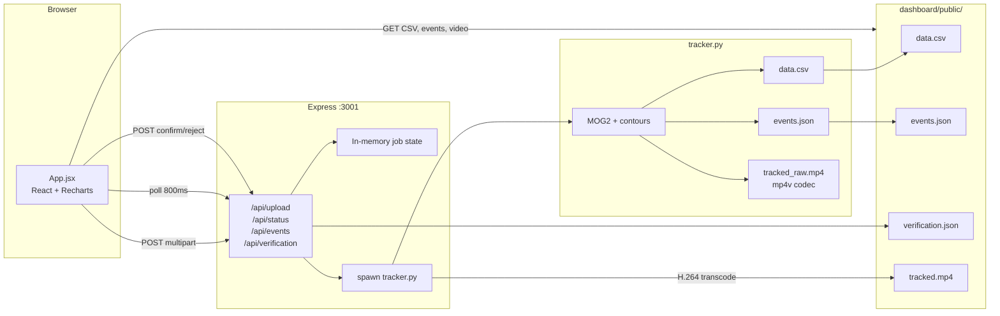

# Flyt — Agent Context & Codebase Guide

> **Living document.** Read this first in every session. Update it when architecture, APIs, file paths, or priorities change.
>
> **Companion doc:** [`gemini.md`](gemini.md) mirrors this file for Gemini sessions. **Keep both in sync.** This file is canonical.
>
> **Last audited:** 2026-06-18 (additional fps/sleep robustness fixes)
> **Codebase version:** PoC (pre-major-refactor)  
> **Maintainers:** All agents working on Flyt

Welcome, Agent! You are assisting in the development of **Flyt**, a local Proof of Concept (PoC) for automating the tracking and behavioral analysis of fruit flies (*Drosophila melanogaster*).

---

## Quick Start (30 seconds)

| Step | Action |
|------|--------|
| 1 | Read [`handoff-current.md`](handoff-current.md) then this file (and [`gemini.md`](gemini.md) if using Gemini) |
| 2 | Skim [`improvements.md`](improvements.md) for the prioritized backlog |
| 3 | Run: double-click [`START.bat`](START.bat) **or** `cd "source app folder/dashboard" && npm run dev` |
| 4 | Dashboard → `http://localhost:5173` · API → `http://localhost:3001` |

**Do not** guess biology/CV algorithms. Follow the [Deep Research Protocol](#deep-research-protocol) below.

---

## Primary Directives

1. **Read the status & task board first**
   - Before taking any action or writing code, read [`improvements.md`](improvements.md). It contains the current system architecture, prioritized backlog, and recommendations from previous sessions.
2. **Scientific precision & clarity**
   - This software is used in an academic behavioral biology lab (Dr. N.G. Prasad's Lab at IISER Mohali). Code accuracy and data integrity are paramount.
   - Do not use mockups or client-side placeholders for features that affect data metrics (velocity, activity, proximity, sleep, courtship index, etc.).
3. **Keep code clean and documented**
   - Maintain the lightweight, CPU-friendly OpenCV Python backend.
   - Do not introduce heavy GPU or deep-learning dependencies unless explicitly requested.

---

## What We Are Building

**Flyt** (formerly *DrosUI*) is a **local, CPU-first, publication-oriented** pipeline for tracking and phenotyping *Drosophila melanogaster* behavior. Target users: behavioral biology labs with modest hardware (e.g. i5 laptop, 8 GB RAM, no GPU).

### Scientific context
- **Lab:** Dr. N.G. Prasad's Evolutionary Biology Lab, IISER Mohali
- **Primary assay:** Top-down view of a **square acrylic mating chamber** with **two flies** (male + female)
- **Goal:** Automate tracking → derive ethologically meaningful metrics → let researchers **verify** before publishing

### Product positioning (architectural consensus)
Flyt's strongest angle is **not** "AI-powered ethology." It is:

> A transparent, deterministic, locally reproducible fly tracking and human-verifiable annotation system for low-resource labs.

Keep the core tracker auditable. Treat any future LLM/VLM layer as **optional, sandboxed, and non-authoritative**.

### Gold reference (mandatory for agents)

- **Read-only baseline:** `E:\prasad-pitch` — original working pitch code. **Never edit.**
- **Production tracker** in Flyt must match `prasad-pitch` core output until A/B on real lab videos proves otherwise.
- Experimental CV (ToxId, scipy, Kalman, etc.) requires **opt-in flag or branch** + user sign-off — not silent replacement.

### Long-term vision
1. Reliable 2-fly courtship tracking with identity continuity through contact *(deferred — pitch NN is current default)*
2. Multi-vial / multi-arena scalability (in-memory ROI, not 12 parallel ffmpeg jobs)
3. Human-in-the-loop verification for publishable metrics
4. Export to Prism, PDF, and universal pose-tracker CSVs (SLEAP, DeepLabCut)
5. Packaging: PyPI + Conda + JOSS publication path

---

## Repository Map

```
E:\Flyt\
├── AGENTS.md              ← YOU ARE HERE — living agent guide (canonical)
├── handoff-current.md     ← ★ Session handoff — read before coding
├── gemini.md              ← Mirror of AGENTS.md for Gemini sessions
├── START.bat              ← One-click dev start (npm run dev)
├── improvements.md        ← Prioritized backlog & architecture notes (UPDATE when shipping)
├── assets/                ← Sample input videos (not processed output)
│   ├── fly_video.mp4
│   └── Drosophila_courtship_and_copulation_1080P.mp4
├── thinking/              ← Multi-model architectural reviews (reference only)
├── researches/            ← Long Deep Research reports (skip unless needed)
├── mcps/
│   └── serpapi/           ← MCP search tool config
└── source app folder/
    ├── tracker/           ← Python OpenCV tracking backend
    │   ├── tracker.py     ← ★ Core CV pipeline (pitch core + events; ~400 lines)
    │   ├── requirements.txt
    │   └── venv/          ← Windows venv (Python 3.11+)
    └── dashboard/         ← React + Express full-stack UI
        ├── server.js      ← ★ API orchestration & job system
        ├── src/
        │   ├── App.jsx    ← ★ Entire frontend (single file, ~800 lines)
        │   ├── main.jsx
        │   └── index.css
        ├── public/        ← Served static outputs (CSV, video, icons)
        │   ├── data.csv   ← Latest tracking output
        │   ├── events.json        ← Suspected events (tracker output)
        │   ├── verification.json  ← User confirm/reject verdicts
        │   ├── run_metadata.json  ← Frame sync + fps metadata
        │   └── tracked.mp4
        ├── uploads/       ← Temp uploaded videos (created on first upload)
        ├── vite.config.js ← Proxies /api → localhost:3001
        └── package.json
```

### Intentionally monolithic (for now)
The PoC keeps logic in **three files**:
- `tracker.py` — all CV
- `server.js` — all backend
- `App.jsx` — all frontend

Major refactor will likely split these. Document splits here when they happen.

### Core entry points
- **Python tracker:** [`source app folder/tracker/tracker.py`](source%20app%20folder/tracker/tracker.py)
- **Express server:** [`source app folder/dashboard/server.js`](source%20app%20folder/dashboard/server.js)
- **React dashboard:** [`source app folder/dashboard/src/App.jsx`](source%20app%20folder/dashboard/src/App.jsx)

---

## System Architecture



### Request lifecycle

1. User uploads video via `UploadView` → `POST /api/upload`
2. Server saves to `dashboard/uploads/input_video.<ext>`, responds **immediately**
3. Server spawns `tracker.py` with `--output-csv`, `--output-events`, `--proximity-threshold`, `--bout-min-frames`, area bounds
4. Frontend polls `GET /api/status` every 800 ms for `framesProcessed` / `progress`
5. On exit code 0: server verifies frame/CSV sync, writes `run_metadata.json` (includes `fps` from `events.json`), **ffmpeg-transcodes** `tracked_raw.mp4` → H.264 `tracked.mp4`, deletes raw; clears `verification.json`
6. Frontend calls `loadData()` + fetches `/api/events` and `/api/verification` → charts + verification panel
7. Researcher confirms/rejects events via `POST /api/verification`; courtship stat shows verified vs detected counts

---

## Core Components

### 1. Python Tracker (`tracker.py`)

**Algorithm (current — matches `prasad-pitch` core):**
```
Video frame
  → MOG2 background subtraction (history=500, varThreshold=50)
  → Morphology open/close (5×5 kernel)
  → Optional ROI mask on fgmask (CLI `--roi`)
  → External contours, min/max area filter (CLI `--min-area`, `--max-area`)
  → Take 2 largest contours
  → Nearest-neighbor identity assignment (2 blobs)
  → 1 blob (merge): both flies → same centroid, proximity = 0, occlusion_flag = 1
  → 0 blobs: hold last known positions
  → Compute speed (px/frame), proximity (Euclidean px)
  → Draw overlays → write mp4v video + append CSV row
  → Post-loop: detect courtship_bout + low_confidence_segment → events.json
```

**Flyt-only metadata columns** (do not affect core x/y assignment): `occlusion_flag`, `identity_confidence` (NN assignment margin heuristic), `fly1_area`, `fly2_area`.

> **History:** Phase 2 ToxId-Light + scipy was shipped 2026-06-14 and **reverted 2026-06-15** after regression vs pitch. See [`handoff-current.md`](handoff-current.md).

**CLI arguments:**

| Flag | Default | Purpose |
|------|---------|---------|
| `--input` | `../../assets/fly_video.mp4` | Input video path |
| `--output-video` | `output_tracked.mp4` | Annotated video output |
| `--output-csv` | `fly_tracking_data.csv` | Per-frame metrics CSV |
| `--output-events` | none | Suspected events JSON (`events.json`) |
| `--no-video` | off | Skip video writing |
| `--min-area` | `30` | Minimum contour area (px²) |
| `--max-area` | `0` (no limit) | Maximum contour area (px²); server passes `0` (matches pitch) |
| `--roi` | none | Rectangular ROI as `x,y,w,h` pixels |
| `--proximity-threshold` | `60` | Courtship bout proximity (px); server passes default |
| `--bout-min-frames` | `90` | Min consecutive frames for courtship bout (~3 s @ 30 FPS) |

**Event detection (Phase 3):** After tracking, sustained segments become suspected events:
- `courtship_bout`: `proximity_distance < threshold` for ≥ `bout_min_frames`
- `low_confidence_segment`: `identity_confidence < 0.2` for ≥ 30 frames

**Progress reporting:** Prints `Processed N frames...` every 100 frames (parsed by `server.js`). On completion prints `TRACKER_SYNC` line for frame/CSV verification.

**Dependencies:** `opencv-python`, `pandas`, `numpy` only.

**Not implemented yet (planned / deferred):**
- ToxId-Light / Hungarian re-ID (deferred — experimental only with A/B proof)
- Interactive ROI UI (CLI `--roi` implemented)
- Scale calibration (px → mm)
- Settings UI → CLI passthrough (server passes hardcoded defaults)
- Tracker-side sleep ethology (sleep still client-side in `App.jsx`)
- Low-confidence event tuning (reduce pre-init noise in `events.json`)

---

### 2. Express Server (`server.js`)

**Port:** 3001  
**Python path:** Hardcoded `tracker/venv/Scripts/python.exe` (Windows)  
**FFmpeg:** `ffmpeg-static` — transcodes `tracked_raw.mp4` → H.264 `tracked.mp4` after tracking  
**Tracker defaults:** `--min-area 30 --max-area 0 --proximity-threshold 60 --bout-min-frames 90` (no ROI until configured)

**Routes:**

| Method | Path | Behavior |
|--------|------|----------|
| `GET` | `/api/status` | Returns in-memory `job` object |
| `POST` | `/api/upload` | Multer single file `video`, max 10 GB, starts background tracking; clears `verification.json` |
| `POST` | `/api/reset` | Kills active tracker, resets job to idle |
| `GET` | `/api/events` | Serves `public/events.json` (404 if missing) |
| `GET` | `/api/verification` | Serves `public/verification.json` (empty reviews if missing) |
| `POST` | `/api/verification` | Body `{ eventId, verdict: "confirmed" \| "rejected" }` — upsert review |
| `POST` | `/api/verification/reset` | Clears all reviews |
| `GET` | `/api/history` | Returns `public/history.json` run metadata list (newest first) |
| `GET` | `/api/history/:runId` | Returns a single run's metadata |
| `DELETE` | `/api/history` | Clears `history.json` metadata (snapshot files left on disk) |

**History snapshots** (2026-06-17 / K-06): on every successful tracking run, `data.csv` + `events.json` are copied to `public/history/<runId>/`. The dashboard History tab lists runs and can reload a past run's dataset into the active view. Tracked video is **not** snapshotted (K-15).

**Job state shape:**
```json
{
  "status": "idle | uploading | processing | done | error",
  "progress": "human-readable string",
  "framesProcessed": 0,
  "totalFrames": null,
  "frameCount": null,
  "error": null,
  "startTime": null,
  "endTime": null
}
```

**Concurrency:** Single job only. Returns `409` if upload attempted while `processing`.

**stderr handling:** OpenCV H.264 NAL warnings are logged but not treated as errors.

---

### 3. React Dashboard (`App.jsx`)

**Single-file SPA** with four logical views (tabs):

| Tab | Component | Status |
|-----|-----------|--------|
| Dashboard | `DashboardView` | **Live** — CSV charts, jump-to-frame input, verification panel (seek, confirm/reject; courtship-only by default) |
| Analyze Output | `UploadView` | **Live** — real upload + polling |
| History | inline in `App` | **Mock** — hardcoded rows |
| Settings | `SettingsModal` | **Mock** — local state only, not sent to backend |

**Data loading:** `Papa.parse('/data.csv')` on mount and after successful upload.

**Metrics sources:**

| Metric | Source | Caveats |
|--------|--------|---------|
| Courtship bouts | `events.json` + `verification.json` | Tracker: sustained proximity; UI shows **verified / detected** |
| Sleep time | Client `loadData()` | `activity_level < 10` for >150 frames; assumes 30 FPS; not standard sleep definition |
| Heatmap | Client `loadData()` | Fly 1 XY, 1-in-5 frame downsample; Fly 2 ignored |
| Avg proximity | Client `loadData()` | Mean of `proximity_distance`; includes overlap frames |

**UI stack:** React 19, Tailwind 4, Recharts, Lucide icons, dark mode toggle.

**Placeholder buttons (no handlers):**
- "Download CSV (Prism)"
- "Export PDF Report"

**UploadView cleaned:**
- Removed non-functional "Output Selection" and "Camera Perspective" controls (they were local state only and never affected uploads or tracking). Upload flow is now simpler and focused on file selection.

---

## Data Schema

### CSV output (`public/data.csv`)

| Column | Type | Unit | Description |
|--------|------|------|-------------|
| `frame` | int | index | 0-based frame number |
| `fly1_x`, `fly1_y` | int | pixels | Fly 1 centroid |
| `fly2_x`, `fly2_y` | int | pixels | Fly 2 centroid |
| `fly1_speed`, `fly2_speed` | float | px/frame | Euclidean displacement from previous frame (parity-identical to pitch gold) |
| `fly1_speed_pxsec`, `fly2_speed_pxsec` | float | px/sec | Temporal-normalized speed = displacement × effective_fps (Flyt-only, 2026-06-17). Used by velocity chart + Prism export |
| `activity_level` | int | px² | `countNonZero` on foreground mask |
| `proximity_distance` | float | pixels | Distance between fly centroids; 0 when merged (pitch behavior) |
| `occlusion_flag` | int | 0/1 | 1 = merged blob / occluded frame |
| `identity_confidence` | float | 0–1 | NN assignment margin heuristic (not true re-ID confidence) |
| `fly1_area`, `fly2_area` | float | px² | Contour area (0 when unknown/occluded) |

**Future columns to add:** `event_tags`, timestamps in seconds.

### Events output (`public/events.json`)

```json
{
  "version": 1,
  "fps": 30.0,
  "total_frames": 1375,
  "detection_params": { "proximity_threshold_px": 60, "bout_min_frames": 90 },
  "events": [
    {
      "id": "evt-001",
      "type": "courtship_bout",
      "start_frame": 120,
      "end_frame": 210,
      "start_time_sec": 4.0,
      "end_time_sec": 7.0,
      "duration_sec": 3.0,
      "mean_proximity_px": 42.5,
      "min_identity_confidence": 0.31,
      "occlusion_fraction": 0.12,
      "detection_reason": "proximity_sustained"
    }
  ]
}
```

Event types: `courtship_bout`, `low_confidence_segment`.

### Verification state (`public/verification.json`)

User verdicts only (separate from raw detection):

```json
{
  "version": 1,
  "reviews": [
    { "event_id": "evt-001", "verdict": "confirmed", "reviewed_at": "2026-06-15T12:00:00.000Z" }
  ]
}
```

### Run metadata (`public/run_metadata.json`)

Includes `fps` (from `events.json`), `syncOk`, `framesProcessed`, `timestamp`.

---

## Target Assay Environment

From `improvements.md` — agents must respect these physical constraints when tuning CV:

| Feature | CV implication |
|---------|----------------|
| High-texture mesh bottom | MOG2 + 5×5 morph close to prevent grid breaking contours |
| White cotton plug (corner) | Upper area bound filter (~30–250 px) to ignore large static blobs |
| Reflective acrylic walls | ROI crop to inner mesh; exclude border reflections |
| Male/female size dimorphism | Use area history for re-ID after collisions |

---

## Known Issues & Technical Debt

> Update this table when fixing or discovering issues. Move rows to **Resolved** with date.

| ID | Severity | Issue | Location | Notes |
|----|----------|-------|----------|-------|
| K-02 | **Critical** | Identity swap after fly overlap/crossing | `tracker.py` | Pitch nearest-neighbor only; ToxId experiment reverted 2026-06-15 |
| K-03 | **High** | Merged contour sets both flies to same point, proximity=0 | `tracker.py` | Pitch behavior; loses individual trajectories during contact |
| K-05 | **Medium** | Sleep metric still client-side with ad-hoc thresholds | `App.jsx:loadData()` | Courtship bout detection + human verification live (Phase 3); sleep ethology deferred |
| K-10 | **Low** | Hardcoded run ID `DROS-COURTSHIP-001` | `DashboardView` | Cosmetic |
| K-13 | **Low** | Noisy `low_confidence_segment` events in tracker output | `tracker.py` event detection | UI hides by default (courtship only); tracker tuning deferred — see handoff option C |
| K-15 | **Low** | Historic-run video not archived (only CSV+events) | `server.js` snapshot | By design (disk); past-run reload falls back to "video unavailable" |

### Resolved

| ID | Date | Issue | Fix |
|----|------|-------|-----|
| K-01 | 2026-06-14 | Tracked video showed original upload, not annotated output | `ffmpeg-static` H.264 transcode of `tracked_raw.mp4` → `tracked.mp4` in `server.js` |
| K-09 | 2026-06-14 | No contour area CLI | `--min-area` / `--max-area` CLI in `tracker.py`; server uses `min=30`, `max=0` (pitch match) |
| K-11 | 2026-06-14 | `scipy` listed but unused | Resolved briefly via Phase 2; scipy removed again on pitch revert (2026-06-15) |
| K-14 | 2026-06-15 | Jump-to-frame UI incomplete | `App.jsx` | Frame input + button beside video; `currentTime = frame / runFps`; live frame readout |
| K-04 | 2026-06-17 | Settings modal not connected to backend | `App.jsx` SettingsModal (4 controlled inputs: minArea, maxArea, proximityThreshold, boutMinFrames) → FormData → `/api/upload` body → `buildTrackerArgs` (validated/clamped; falls back to pitch defaults on invalid). Modal now has real state + Apply/Reset |
| K-06 | 2026-06-17 | History tab was mock data | Per-run CSV+events snapshot to `public/history/<runId>/`; metadata in `public/history.json`; `GET /api/history`, `GET /api/history/:runId`, `DELETE /api/history`. History tab renders real rows; click reloads run into dashboard (video not archived — see K-15) |
| K-07 | 2026-06-17 | Export buttons were UI-only | "Download CSV (Prism)" → `exportPrismCsv()` (column-oriented: `Time (sec)`, `Fly1_Velocity`, `Fly2_Velocity`, `Distance`); "Export PDF Report" → `window.print()` with `@media print` rules in `index.css` hiding nav/sidebar/buttons |
| K-08 | 2026-06-17 | Speed was px/frame not px/sec | Added `fly1_speed_pxsec` / `fly2_speed_pxsec = displacement × effective_fps` columns in `tracker.py` + `run_modal.py`. **Core `fly1_speed`/`fly2_speed` untouched** (px/frame, parity-identical to pitch gold — honors Rule #2). Prism export + velocity chart (completed 2026-06-18) use the new columns |
| K-12 | 2026-06-17 | Windows-only python path in server | `server.js`: `isWindows = process.platform === 'win32'`; `pythonExe` resolves `venv/Scripts/python.exe` (Win) or `venv/bin/python` (POSIX) |
| K-16 | 2026-06-18 | Velocity chart plotted px/frame columns (despite "px/sec" title post K-08) | Switched LineChart dataKeys to `fly1_speed_pxsec` / `fly2_speed_pxsec`; added legacy column normalization in `loadData()` for old CSVs |
| K-17 | 2026-06-18 | `clearHistoryServer` called undefined `setHistoryCleared` (crash on "Clear History") | Removed erroneous line (state was never declared) |

---

## Priority Backlog

Synced from [`improvements.md`](improvements.md). **Update status column as work progresses.**

| # | Priority | Feature | Status | Primary files |
|---|----------|---------|--------|---------------|
| 1 | High | H.264 transcoding of annotated video | `done` | `server.js`, `ffmpeg-static` |
| 2 | High | ToxId-Light + Hungarian crossing resolution | `deferred` | `tracker.py` — reverted; opt-in + A/B only |
| 3 | High | Human-in-the-loop timestamp verification | `done` | `tracker.py`, `server.js`, `App.jsx` |
| 4 | High | Multi-vial arena segmentation (in-memory ROI) | `not started` | new module, `server.js`, `App.jsx` |
| 5 | Medium | Wire settings → CLI args | `done 2026-06-17` | `App.jsx`, `server.js` (K-04) |
| 6 | Medium | Prism CSV + PDF export | `done 2026-06-17` | `App.jsx`, `index.css` (K-07) |
| 7 | Medium | Universal pose CSV import (SLEAP/DLC) | `not started` | `App.jsx` |
| 8 | Medium | Behavior selection + feasibility scorecard | `not started` | `App.jsx`, `tracker.py` |
| 9 | Medium | Interactive scale calibration (px→mm) | `not started` | `App.jsx`, `tracker.py` |
| 10 | Medium | Multi-arena ROI masking UI | `not started` | `App.jsx`, `tracker.py` |
| 11 | Low | Real run history (JSON/SQLite) | `done 2026-06-17` | `server.js`, `App.jsx` (K-06, JSON store) |
| 12 | Launch | PyPI / Conda / GitHub / JOSS packaging | `not started` | new `pyproject.toml`, repo structure |

### Architectural guidance (from `thinking/` reviews — do not ignore)

1. **Multi-vial:** Prefer **in-memory numpy ROI slicing** over 12 parallel ffmpeg processes on i5 hardware.
2. **Crossing resolution:** Future work only — pitch NN is production default. Any ToxId/occlusion experiment needs A/B vs `prasad-pitch` before merge.
3. **Hu moments alone are insufficient** for dorsal-view *Drosophila* — combine area, aspect ratio, orientation, trajectory continuity (reference for deferred backlog #2).
4. **Local AI (Gemma/PaliGemma):** Defer until 2-fly pipeline is validated. Text-only Gemma 2B is feasible; PaliGemma real-time is not on target hardware.

---

## Development Guide

### Prerequisites
- Node.js 16+ (tested: v24)
- Python 3.8+ (tested: 3.11)
- Windows paths assumed for venv (`Scripts/python.exe`)

### Setup
```bash
# Dashboard
cd "source app folder/dashboard"
npm install

# Tracker (if venv missing)
cd "../tracker"
python -m venv venv
venv\Scripts\activate
pip install -r requirements.txt
```

### Run (recommended)
```bash
cd "source app folder/dashboard"
npm run dev
```
Starts Express (:3001) + Vite (:5173) via `concurrently`.

### Run tracker standalone
```bash
cd "source app folder/tracker"
venv\Scripts\python.exe tracker.py --input "..\..\assets\fly_video.mp4" --output-csv test.csv
```

### Manual API test
```bash
curl http://localhost:3001/api/status
```

---

## Agent Operating Rules

### Always
1. Read [`handoff-current.md`](handoff-current.md) + `AGENTS.md` + [`gemini.md`](gemini.md) + `improvements.md` before coding
2. Preserve scientific data integrity — no fake metrics
3. Keep CPU-only OpenCV unless explicitly asked for ML
4. Match existing code style (monolithic files, minimal abstractions for now)
5. **Update this file and `gemini.md`** when you change architecture, APIs, schemas, agent rules, or fix known issues
6. **Regression-test tracker** vs `prasad-pitch` on `fly_video.mp4` before claiming CV improvements

### Never
1. **Edit `E:\prasad-pitch`** — read-only gold copy
2. Replace pitch tracker core without opt-in flag/branch + A/B proof on real videos
3. Ship client-side mock data as if it were tracked output
4. Guess ethological definitions (sleep bout length, courtship index formula, etc.)
5. Introduce GPU/deep-learning deps without explicit approval
6. Spawn 12 parallel ffmpeg encodes on consumer hardware
7. Block upload→results with landing pages, full-screen overlays, or tab locks during processing

### Deep Research Protocol ("Ego-Free")

The developer has **high-level access to Gemini Deep Research**. Use it for complex biological, computer-vision, or algorithmic problems instead of guessing or shipping sub-optimal solutions.

**Trigger this protocol when:**
- **Algorithmic complexity** — unsure of the best lightweight tracking/association approach (Hungarian algorithm, Kalman filters, ellipse fitting, occlusion handling).
- **Biological standards** — unsure of standard definitions for fly phenotypes (aggression index, circadian sleep, courtship bouts, courtship index).
- **Unclear system behavior** — hit an error or dependency limitation you cannot resolve after a quick search.

**You must:**
1. **Drop your ego** — stop guessing or writing arbitrary code for that feature.
2. **Draft a context & prompt** — write a detailed summary of the codebase state, the exact problem, and a structured **Google Deep Research prompt** for the user.
3. **Delegate** — present the prompt and ask the user to run it in Deep Research and return the report (save outputs to `researches/` when provided).
4. **Pause** — wait for the report before writing implementation code for that specific feature.

---

## Suggested Refactor Targets (upcoming)

When the major improvements begin, likely package structure:

```
flyt-core/          Python tracking library (src layout)
  ├── tracker/      MOG2 pipeline, assignment, events
  ├── metrics/      Courtship, sleep, locomotion calculators
  └── cli.py

flyt-server/        Node orchestration (current server.js evolved)
flyt-dashboard/     React app (split App.jsx into views/components)
```

Document the actual structure here once created.

---

## Reference Documents

| File | Purpose | When to read |
|------|---------|--------------|
| [`handoff-current.md`](handoff-current.md) | Current state, rules, regression checks | **Every session — read first** |
| [`AGENTS.md`](AGENTS.md) | Canonical codebase map, APIs, known issues | Every session |
| [`gemini.md`](gemini.md) | Mirror for Gemini sessions | Gemini entry point |
| [`improvements.md`](improvements.md) | Backlog detail & assay specs | Before prioritizing work |
| [`thinking/*.md`](thinking/) | Multi-model architecture reviews | When designing algorithms |
| [`researches/*.md`](researches/) | Long Deep Research dumps | Only when relevant to current task |
| [`dashboard/README.md`](source%20app%20folder/dashboard/README.md) | Dashboard setup commands | Onboarding |

---

## Changelog (agents: append entries)

**Detailed changelog history lives in [`changelog.md`](./changelog.md) at the project root.**

All future changes (including agent sessions) should be appended there using the date + model/agent format.

Recent activity (before centralization):
- 2026-06-18 Grok 4.3 — Full analysis + direction review + fixes (velocity chart, history crash, UploadView cleanup, improved sleep metric, docs).
- 2026-06-17 z-code — Tasks A–E shipped (settings, speed, history, exports, cross-platform).
- Earlier phases and reverts (2026-06-14 → 06-15) documented in `changelog.md`.

### How to update this document

**Update both `AGENTS.md` and `gemini.md` together** — they must stay in sync.

For pure changelog entries, append to `changelog.md` (preferred).

When you change architecture, APIs, schemas, rules, backlog status, or other living content:
- Update both agent guides.
- Also record the high-level note in `changelog.md`.
- Update: Known Issues, Priority Backlog, Data Schema, API routes, Repository Map, Last audited date.

---

## Glossary

| Term | Meaning |
|------|---------|
| **ToxId-Light** | Deferred experimental re-ID (area + Hu + Hungarian) — not in production tracker |
| **prasad-pitch** | Read-only gold reference at `E:\prasad-pitch`; production tracker must match its core CSV output |
| **MOG2** | OpenCV adaptive background subtractor used for foreground detection |
| **Courtship bout** | Sustained close proximity (`<60 px` default, ≥90 frames); human-verifiable via dashboard |
| **Occlusion segment** | Period where two flies merge into one contour |
| **ROI** | Region of interest mask or crop limiting tracking area |
| **Prism format** | Column-oriented CSV layout for GraphPad Prism import |