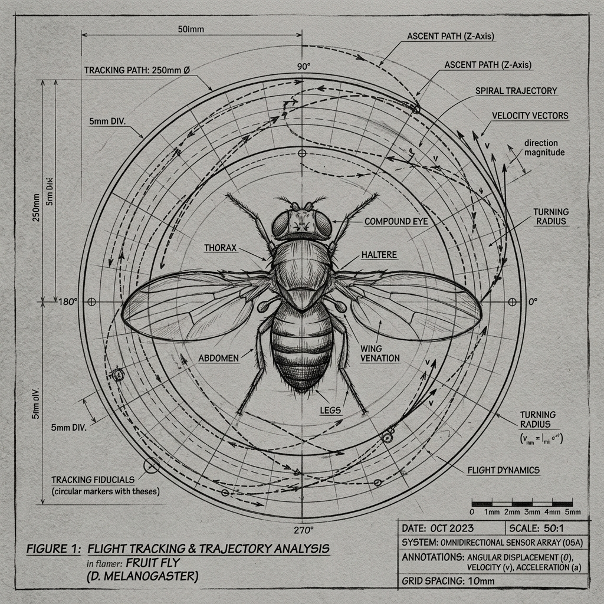
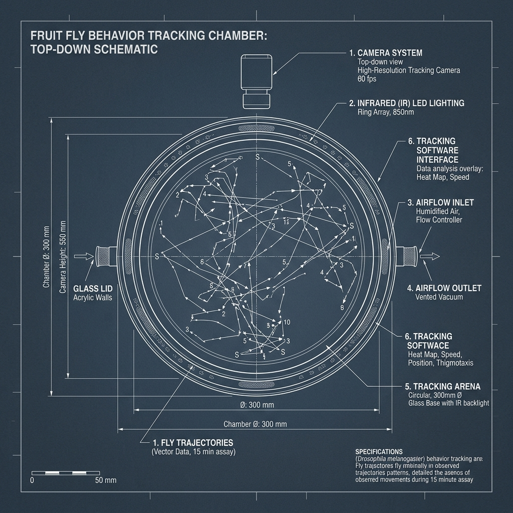
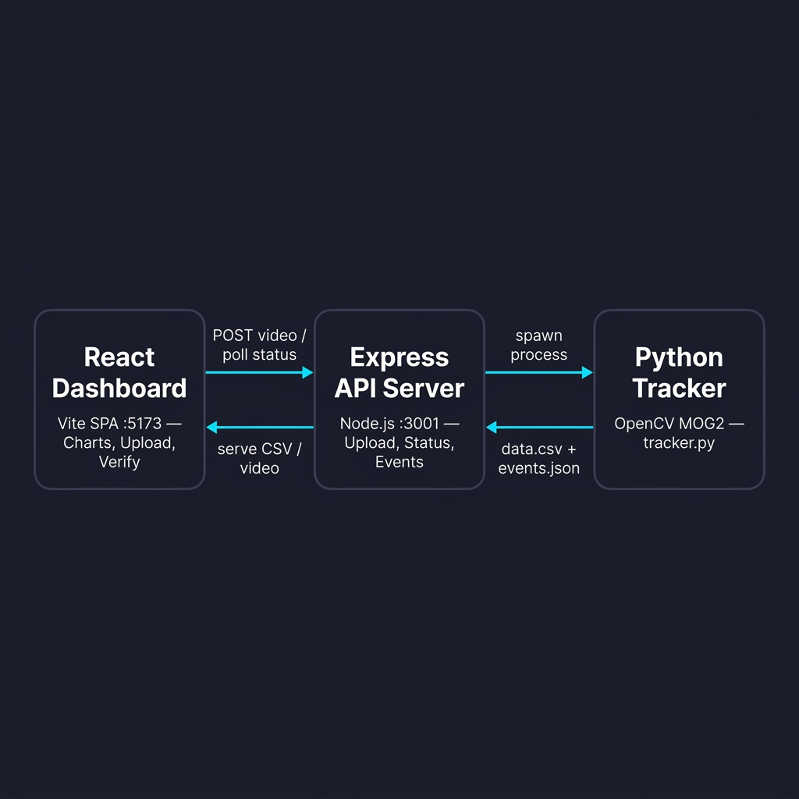

#  Flyt — Deterministic Drosophila Behavior Tracking Dashboard

[](https://github.com/sudoax0n/flyt)
[](https://opensource.org/licenses/MIT)
[](https://www.python.org/)
[](https://nodejs.org/)

**Flyt** is a local, CPU-first, publication-oriented computer vision pipeline and full-stack dashboard designed for tracking and phenotyping *Drosophila melanogaster* behavior. Built specifically for evolutionary biology and behavioral labs, Flyt provides a transparent, deterministic tracking engine paired with a premium human-in-the-loop validation interface.

---

## 🎨 Scientific & Experimental Setup

Flyt is optimized for tracking two flies (typically male and female mating pairs) inside a square acrylic mating chamber. The system accounts for real-world laboratory assay constraints:

<p align="center">
  
  <br>
  <em>Conceptual sketch of the fruit fly mating chamber and tracking overlays.</em>
</p>

*   **High-Texture Mesh Bottom**: Employs morphology closing and adaptive thresholding to model mesh variance without fracturing contours.
*   **Cotton Plug Filter**: Filters out static background objects in the corners (like white cotton plugs) based on strict contour bounding area history.
*   **Reflective Acrylic Walls**: Accommodates reflections by offering configurable Region of Interest (ROI) bounds.
*   **Size Dimorphism**: Track trajectories are maintained across overlaps by leveraging size differences between the larger female and smaller male flies.

---

## 🚀 Key Features

*   **deterministic CV Engine**: A lightweight, CPU-friendly OpenCV Python backend. No heavy GPU or deep-learning dependencies are required for baseline tracking.
*   **Interactive Web Dashboard**: React Single Page Application (SPA) styled with custom dark-mode aesthetics, featuring rich Recharts visualizations for velocity, inter-fly proximity, and spatial heatmaps.
*   **Human-in-the-Loop Validation**: Review automatically detected courtship bouts, seek directly to relevant video timestamps, and confirm or reject annotations to generate publication-grade metrics.
*   **GraphPad Prism & PDF Export**: One-click formatting of raw trajectory data into column-oriented CSV formats for GraphPad Prism, and custom print styles to export visual reports directly to PDF.
*   **Windows & Linux Parity**: Run locally on Windows or offload batch sweeps to **Modal** serverless cloud infrastructure. PNG-lossless frame pipelines eliminate cross-platform decoding drift, guaranteeing exact $0$-diff trajectory parity.

---

## 🏛️ System Architecture

Flyt isolates tracking computation from UI state while ensuring immediate feedback loops. The local setup runs a Node.js Express server to orchestrate processes, write CSV outputs, and spawn the Python OpenCV sub-process:

<p align="center">
  
  <br>
  <em>Whiteboard schematic of Flyt's full-stack architecture and data flow.</em>
</p>

---

## ⚙️ Quick Start (Local Setup)

### 1. Clone the Repository
```bash
git clone https://github.com/sudoax0n/flyt.git
cd flyt
```

### 2. Set Up the Python Tracker
Navigate to the tracker directory, create a virtual environment, and install dependencies:
```bash
cd "source app folder/tracker"
python -m venv venv

# Activate virtual environment
# Windows:
venv\Scripts\activate
# macOS/Linux:
source venv/bin/activate

pip install -r requirements.txt
```

### 3. Set Up and Run the Dashboard
Navigate to the dashboard directory, install Node packages, and launch the concurrently run development servers (Express backend on `:3001` and Vite frontend on `:5173`):
```bash
cd "../dashboard"
npm install
npm run dev
```
Open your browser and navigate to `http://localhost:5173`.

---

## ☁️ Cloud Execution (Modal Integration)

If you are dealing with high-throughput video sweeps and want to scale runs on serverless compute, authenticate your environment and invoke the cloud worker:

```bash
# Authenticate with Modal
cd flyt-modal
AUTH-MODAL.bat

# Execute cloud tracking job with lossless PNG parity checks
RUN-MODAL-PARITY.bat
```

---

## 📂 Key File Structure

```
flyt/
├── assets/                  # Sample input videos & sketch-style graphics
├── source app folder/
│   ├── tracker/             # Python OpenCV tracking script & venv
│   │   └── tracker.py       # Core CV pipeline (~400 lines)
│   └── dashboard/           # Full-stack React (Vite) + Node (Express) app
│       ├── server.js        # Orchestration API & H.264 transcoding job loop
│       └── src/
│           ├── App.jsx      # Core React SPA (Visual charts, events reviewer)
│           └── index.css    # Premium CSS design system & print styles
├── flyt-modal/              # Serverless tracking configuration for Modal
└── AGENTS.md                # Detailed developer handbook & living history
```

---

## 📄 License

This project is licensed under the MIT License - see the [LICENSE](LICENSE) file for details.

---

## 🧬 Contributing & Science Context

Flyt was developed in collaboration with researchers at the **Evolutionary Biology Lab (Dr. N.G. Prasad's Lab)**, Indian Institute of Science Education and Research (IISER) Mohali. 

For full details on development history, performance benchmarks, and experimental features, please consult:
*   [AGENTS.md](AGENTS.md) - Project architectural records.
*   [improvements.md](improvements.md) - Active roadmap and backlog status.
