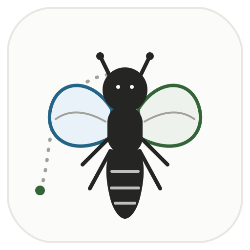
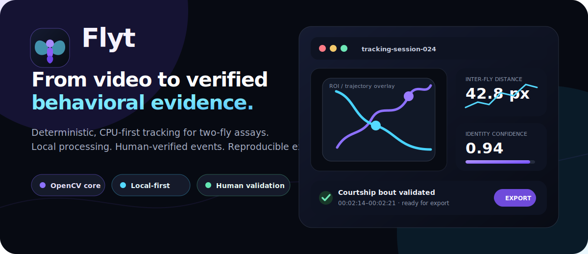
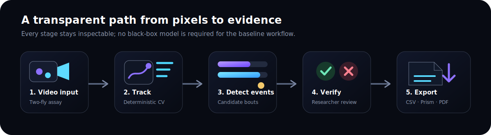
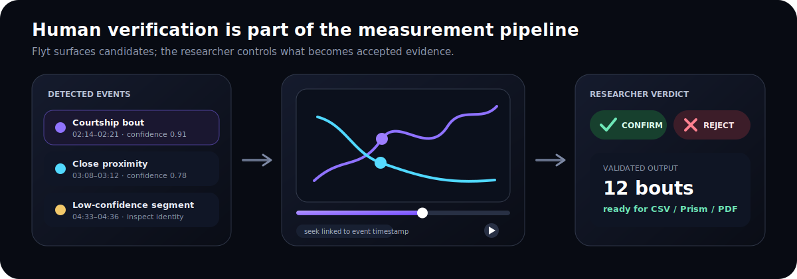

<p align="center">
  
</p>

<h1 align="center">Flyt</h1>

<p align="center">
  <strong>Deterministic Drosophila behavior tracking, built for transparent and verifiable science.</strong>
</p>

<p align="center">
  <a href="https://github.com/sudoax0n/Flyt/releases"></a>
  <a href="LICENSE"></a>
  
  
  
</p>

<p align="center">
  
</p>

Flyt is a local, CPU-first computer-vision pipeline and full-stack dashboard for tracking and phenotyping *Drosophila melanogaster* behavior. It combines a lightweight OpenCV tracker with a researcher-facing review interface so trajectories, event candidates, and accepted measurements remain inspectable.

## From pixels to evidence

<p align="center">
  
</p>

The baseline workflow is deliberately transparent:

1. Load a two-fly assay video.
2. Track both subjects with deterministic OpenCV processing.
3. Derive trajectories, speed, proximity, occlusion, and confidence signals.
4. Surface candidate behavioral events.
5. Let the researcher confirm or reject those candidates before export.

## Scientific and experimental setup

Flyt is designed around top-down recordings of a pair of flies—typically a male and female—inside a square acrylic mating chamber.

<p align="center">
  
</p>

The system is intended to handle common assay complications:

- **High-texture mesh bottoms:** morphology and background modelling reduce contour fragmentation.
- **Static corner objects:** area and persistence filtering help suppress cotton plugs and other non-fly regions.
- **Reflective acrylic walls:** configurable regions of interest keep analysis inside the chamber.
- **Size dimorphism and overlap:** trajectory metadata exposes identity confidence and occlusion periods for review.

## Human-in-the-loop validation

<p align="center">
  
</p>

Flyt does not silently turn every detected event into accepted evidence. Candidate bouts remain linked to their video timestamps so a researcher can inspect the relevant frames, confirm or reject the event, and preserve a clear distinction between machine detection and human-validated results.

## Key capabilities

| Area | What Flyt provides |
|---|---|
| Tracking | Two-fly centroid trajectories, nearest-neighbour identity continuity, ROI support, and occlusion metadata |
| Behavioral signals | Speed, inter-fly distance, confidence segments, and candidate courtship bouts |
| Validation | Timestamp-linked video review with confirm/reject decisions |
| Visual analysis | Trajectory overlays, velocity and proximity plots, and spatial heatmaps |
| Export | Raw CSV, GraphPad Prism-oriented CSV, event JSON, run metadata, and print-ready PDF reports |
| Runtime | Local Windows-first workflow with a lightweight Python/OpenCV backend and React dashboard |

## System architecture

<p align="center">
  
</p>

```text
Browser dashboard
      │
      │ upload, status polling, validation
      ▼
Express orchestration server
      │
      │ spawns local tracker process
      ▼
Python / OpenCV tracker
      │
      ├── trajectory CSV
      ├── candidate events JSON
      ├── run metadata
      └── annotated video
```

### Main application components

```text
Flyt/
├── assets/
│   └── images/                         # README and project graphics
└── source app folder/
    ├── tracker/
    │   ├── tracker.py                  # deterministic OpenCV tracking pipeline
    │   └── requirements.txt
    └── dashboard/
        ├── server.js                   # Express API and tracker orchestration
        ├── index.html                  # application metadata and favicon
        ├── public/
        │   └── favicon.svg             # same Flyt mark used in this README
        └── src/
            ├── App.jsx                 # React dashboard
            └── index.css
```

## Quick start

### 1. Clone the repository

```bash
git clone https://github.com/sudoax0n/Flyt.git
cd Flyt
```

### 2. Set up the Python tracker

```bash
cd "source app folder/tracker"
python -m venv venv
```

Activate the environment:

```powershell
# Windows
venv\Scripts\activate
```

```bash
# macOS / Linux
source venv/bin/activate
```

Install tracker dependencies:

```bash
pip install -r requirements.txt
```

### 3. Install and launch the dashboard

```bash
cd "../dashboard"
npm install
npm run dev
```

Open `http://localhost:5173`. The Express API runs on `http://localhost:3001`.

## Baseline tracking philosophy

Flyt's baseline is intentionally:

- **Deterministic:** identical inputs and settings should produce reproducible outputs.
- **Local-first:** routine analysis should not require uploading unpublished laboratory videos.
- **CPU-friendly:** the standard path avoids mandatory GPU and deep-learning dependencies.
- **Reviewable:** uncertainty, occlusion, and candidate events are surfaced rather than hidden.
- **Scientifically conservative:** human verification remains separate from automatic detection.

## Outputs

A successful run can produce:

```text
data.csv             per-frame positions and derived metrics
events.json          candidate behavioral events
verification.json    researcher confirm/reject decisions
run_metadata.json    frame, FPS, and synchronization metadata
tracked.mp4          annotated tracking video
```

## Project scope

Flyt currently focuses on transparent two-fly tracking and review for behavioral assays. Experimental cloud tooling, internal research notes, and development-agent context are intentionally not part of this clean public branch.

## License

Flyt is available under the [MIT License](LICENSE).

## Science context

Flyt was developed for behavioral-biology workflows associated with Dr. N. G. Prasad's Evolutionary Biology Lab at the Indian Institute of Science Education and Research Mohali.
