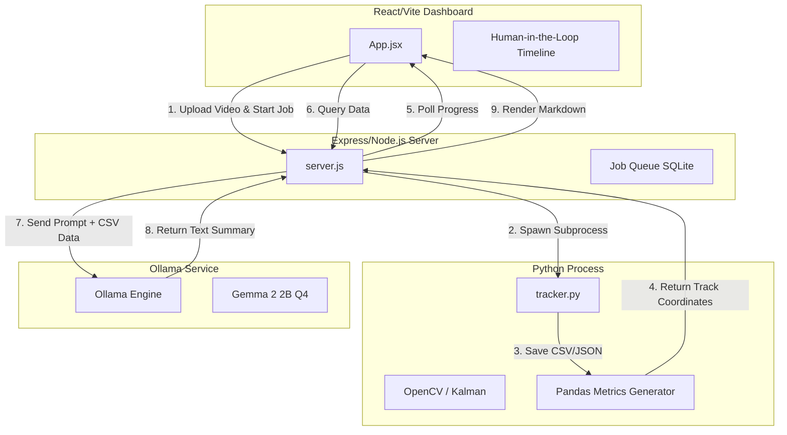
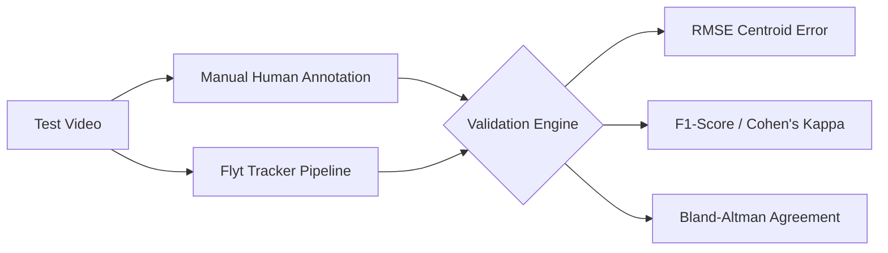

# Flyt: Architectural Evaluation & Backlog Critique
*IISER Mohali Evolutionary Biology Lab — Dr. N.G. Prasad's Lab*

This document provides a Principal Software Architect and Computational Ethologist's review of the **Flyt** (formerly *DrosUI*) visual tracking system. It evaluates the current architecture, critiques the planned improvements backlog, and details the algorithmic, system, and validation enhancements required to elevate Flyt to a publication-grade scientific tool capable of running on consumer hardware (i5-8365U, 8GB RAM, no GPU).

---

## 1. Algorithmic Optimization (CPU Constraints)

### 1.1 Multi-Vial Grid Detection & Crop-Splitting
#### Critique of Planned Approach
The backlog suggests spawning **12 parallel ffmpeg crop processes** to slice a 12-vial video into 12 sub-files for batch processing. On a 4-core, 8-thread i5-8365U CPU, this will cause **extreme system degradation**:
* **Disk I/O Bottleneck:** Writing 12 separate video files simultaneously to a standard laptop SSD (or HDD) creates severe I/O wait times.
* **Decoding Overhead:** 12 parallel ffmpeg instances will decode the same H.264 source stream redundantly, saturating CPU registers and causing thermal throttling.
* **Redundant Storage:** Slicing a 1GB raw video into 12 parts requires an additional 1GB of storage, which is highly inefficient on lab laptops.

#### Recommended Architecture
1. **In-Memory ROI Processing (Primary Solution):**
   Do not split the video file on disk. Instead, detect the 12 vial coordinates (bounding boxes) once at the start. During the tracking phase, read the video stream *once* in Python using a single `cv2.VideoCapture` thread. Slice the regions of interest (ROIs) in memory using numpy array slicing (`frame[y1:y2, x1:x2]`) and pass these ROIs directly to 12 lightweight tracker instances within the same process.
2. **Single-Pass ffmpeg Complex Filtergraph (Fallback Solution):**
   If physical sub-files are strictly required by the lab's folder structure, do it in a single process using ffmpeg's `filter_complex` engine. This decodes the source stream once and branches it into multiple crops in-memory before encoding:
   ```bash
   ffmpeg -i input.mp4 -filter_complex \
   "[0:v]crop=w:h:x1:y1[v1]; \
    [0:v]crop=w:h:x2:y2[v2]; \
    [0:v]crop=w:h:x3:y3[v3]" \
   -map "[v1]" -c:v libx264 -crf 23 -preset superfast output_vial1.mp4 \
   -map "[v2]" -c:v libx264 -crf 23 -preset superfast output_vial2.mp4 \
   -map "[v3]" -c:v libx264 -crf 23 -preset superfast output_vial3.mp4
   ```

#### Automatic Grid Detection Algorithm
For vial segmentation, use classical computer vision to auto-detect the grid structure. Drosophila vials are typically arranged in a clear rectangular matrix.

```python
import cv2
import numpy as np

def detect_vial_grid(video_path):
    cap = cv2.VideoCapture(video_path)
    ret, frame = cap.read()
    cap.release()
    if not ret:
        return []
    
    # 1. Convert to grayscale and apply Gaussian Blur to smooth noise
    gray = cv2.cvtColor(frame, cv2.COLOR_BGR2GRAY)
    blurred = cv2.GaussianBlur(gray, (5, 5), 0)
    
    # 2. Adaptive thresholding to handle uneven laboratory lighting
    thresh = cv2.adaptiveThreshold(
        blurred, 255, cv2.ADAPTIVE_THRESH_GAUSSIAN_C, 
        cv2.THRESH_BINARY_INV, 11, 2
    )
    
    # 3. Morphological closing to merge broken edges of vial borders
    kernel = cv2.getStructuringElement(cv2.MORPH_RECT, (9, 9))
    closed = cv2.morphologyEx(thresh, cv2.MORPH_CLOSE, kernel)
    
    # 4. Find contours
    contours, _ = cv2.findContours(closed, cv2.RETR_EXTERNAL, cv2.CHAIN_APPROX_SIMPLE)
    
    vials = []
    for c in contours:
        x, y, w, h = cv2.boundingRect(c)
        aspect_ratio = float(w) / h
        area = cv2.contourArea(c)
        
        # 5. Filter contours based on expected laboratory vial geometry
        # Adjust these limits based on distance to the vials
        if 2000 < area < 100000 and 0.5 < aspect_ratio < 2.0:
            vials.append((x, y, w, h))
            
    # Sort vials top-to-bottom, then left-to-right
    vials = sorted(vials, key=lambda b: (b[1] // 50, b[0]))
    return vials
```

---

### 1.2 Overlap/Crossing Resolution
#### Critique of Planned Approach
Using a **Bipartite Hungarian solver matching current blobs against historical size averages and Hu-Moments** will fail during physical interactions (crossings) for three reasons:
1. **Moment Deformation:** When two flies touch or mate, they merge into a single contour. The Hu-Moments of this merged blob represent a combined shape, rendering them completely different from the individual flies' historical moments.
2. **Hu-Moments Invariance Limits:** Hu-Moments are scale, translation, and rotation invariant, but they are highly sensitive to noise along contour boundaries. Reflection on acrylic walls or mesh grid textures will distort moments, causing identity swaps.
3. **Loss of Heading Direction:** Hu-Moments cannot distinguish a fly's head from its tail due to axial symmetry.

#### Recommended Robust Architecture: Multi-State Kalman-Hungarian Tracker
To resolve crossings robustly on a CPU:
1. **Fit Ellipses, Not Just Contours:** Use `cv2.fitEllipse` on the thresholded contours. This provides:
   * Centroid coordinates $(x, y)$.
   * Major and minor axes ($a$, $b$). The aspect ratio $a/b$ is a stable proxy for fly body shape.
   * Orientation angle $\theta$ (ranging from $0^\circ$ to $180^\circ$).
2. **Kalman Filters (Constant Velocity Model):** Maintain a Kalman filter for each fly. When two flies are separated, their Kalman filters track their state vector $[x, y, \dot{x}, \dot{y}]$.
3. **Collision Phase Handling:**
   * **Collision Detection:** If the number of detected blobs drops from 2 to 1, or if the contour area of a blob suddenly matches the sum of the historical average areas of both flies, trigger a "Collision State."
   * **During Collision:** Stop updating the Hungarian assignment based on current visual measurements. Instead, propagate the Kalman filters forward using their last known velocities. Keep the predicted coordinates as the flies' virtual locations.
   * **Resolution (Split):** When the single blob splits back into 2 contours, calculate a combined Cost Matrix ($C$) for the Hungarian algorithm.

```python
import numpy as np
from scipy.optimize import linear_sum_assignment

def calculate_association_cost(track_pred, blob_meas, w_dist=0.6, w_size=0.3, w_angle=0.1):
    """
    track_pred: Predicted state from Kalman [x, y, dx, dy, aspect_ratio, angle]
    blob_meas: Measured blob features [x, y, aspect_ratio, angle]
    """
    # 1. Spatial Euclidean Distance Cost
    dist = np.linalg.norm(track_pred[:2] - blob_meas[:2])
    
    # 2. Size (Aspect Ratio) Similarity Cost
    size_diff = abs(track_pred[4] - blob_meas[2])
    
    # 3. Orientation / Angle Cost (handles 0-180 degree wraps)
    angle_diff = abs(track_pred[5] - blob_meas[3])
    angle_diff = min(angle_diff, 180 - angle_diff) / 90.0  # Normalize to 0-1
    
    cost = w_dist * dist + w_size * size_diff + w_angle * angle_diff
    return cost

def resolve_split(tracks, detected_blobs):
    """
    tracks: List of track dicts containing Kalman predictions
    detected_blobs: List of new contours detected after split
    """
    cost_matrix = np.zeros((len(tracks), len(detected_blobs)))
    
    for i, track in enumerate(tracks):
        for j, blob in enumerate(detected_blobs):
            # Extract features
            pred_state = track['kalman'].predict()  # Predicted [x, y]
            track_features = [
                pred_state[0], pred_state[1], 
                track['hist_aspect_ratio'], track['hist_angle']
            ]
            
            x, y, w, h = cv2.boundingRect(blob)
            # Find fitted ellipse details
            if len(blob) >= 5:
                (ex, ey), (ma, mi), angle = cv2.fitEllipse(blob)
                aspect_ratio = ma / max(mi, 1e-5)
            else:
                ex, ey = x + w/2, y + h/2
                aspect_ratio = w / max(h, 1e-5)
                angle = 0
                
            blob_features = [ex, ey, aspect_ratio, angle]
            cost_matrix[i, j] = calculate_association_cost(
                np.array(track_features), np.array(blob_features)
            )
            
    # Solve matching
    row_ind, col_ind = linear_sum_assignment(cost_matrix)
    return list(zip(row_ind, col_ind))
```

---

## 2. Local AI Integration (Gemma / PaliGemma)

### 2.1 Feasibility on low-spec hardware (i5, 8GB RAM, no GPU)
* **Gemma 2 2B (Language Model):** **Highly Feasible.** A quantized version (e.g., `gemma-2-2b-it-Q4_K_M.gguf`) uses roughly $1.6\text{ GB}$ of RAM. Running on `llama.cpp` or `Ollama` utilizing standard CPU AVX2 instructions will yield $8 - 15\text{ tokens/sec}$. This is more than fast enough for interactive querying of experimental summaries and paper drafting.
* **PaliGemma 3B (Vision-Language Model):** **Unfeasible for Pipeline Integration.** PaliGemma contains a Vision Transformer (ViT) encoder and a language decoder. Running vision-language reasoning on a mobile i5 CPU requires $4 - 6\text{ seconds per single frame}$. Slicing a 30 FPS video and passing even selected frames to PaliGemma will cause massive backlog queues and crash the 8GB RAM limit due to context expansion.

### 2.2 System Architecture Recommendations
To prevent AI features from blocking the critical video tracking pipeline, use a decoupled service architecture:



#### Guidelines for implementation:
1. **Decouple Ollama:** Run Ollama as a native OS service rather than running model files inside the Express process. Express should query Ollama via standard REST endpoints (`http://localhost:11434/api/generate`).
2. **Context Size Limitation:** Never feed raw tracking coordinates directly to the LLM. Translate the coordinate CSV file into a compressed summary (e.g., "Vial 1: Male velocity mean=4.2mm/s, Female sleep=140min, Courtship index=0.12") before passing it to Gemma.
3. **Behavior Classification:** Do not use PaliGemma to classify micro-behaviors (grooming, chasing). Instead, train a classical **Random Forest Classifier** or **Support Vector Machine (SVM)** on hand-annotated feature vectors (velocity, distance, rotation velocity) using `scikit-learn`. The classifier runs in milliseconds on CPU and can be bundled directly inside `tracker.py`.

---

## 3. Scientific Rigor & Publishing

To make Flyt a publication-grade tool for behavioral ecology and neuroscience journals (e.g., *Nature Methods*, *PLOS Biology*, *Journal of Experimental Biology*), the software must provide standardized ethological parameters and a transparent validation protocol.

### 3.1 Advanced Ethological Parameters to Add
* **Distance to Partner (D2P) & Heading Angle ($\phi$):**
  Calculate the angle between the male's heading vector and the vector pointing from the male to the female centroid. An angle near $0^\circ$ combined with low D2P indicates active chasing.
* **Courtship Index (CI):**
  The proportion of observation time during which the male displays courtship behaviors (chasing, wing extension, licking) toward the female.
* **Wing Extension Angle:**
  When a male extends one wing to sing to the female, it changes the contour shape. Detect this by tracking the *Convexity Defects* of the fly contour. A sudden protrusion on the lateral contour profile indicates wing extension.
* **Thigmotaxis Index:**
  Drosophila show a natural tendency to walk near walls when anxious (thigmotaxis). Split the chamber coordinates into an "inner zone" and an "outer zone." Calculate the ratio of time spent in the outer boundary zone vs. the center.

$$\text{Thigmotaxis} = \frac{T_{\text{boundary}}}{T_{\text{total}}}$$

* **Sleep Fragmentation:**
  Instead of just total sleep time (defined in Drosophila as 5 minutes of continuous immobility), compute **Sleep Bout Length** and **Bout Number** to assess sleep quality.

---

### 3.2 Quantitative Validation Framework
Reviewers will demand proof of tracking accuracy and behavioral classification reliability. Implement a formal validation suite in Flyt:



1. **Centroid Error Metric (RMSE):**
   Compare the coordinates generated by Flyt ($x_a, y_a$) against manual clicks ($x_m, y_m$) from a human annotator on 1,000 random frames:
   
$$\text{RMSE} = \sqrt{\frac{1}{N} \sum_{i=1}^{N} \left[ (x_{m,i} - x_{a,i})^2 + (y_{m,i} - y_{a,i})^2 \right]}$$

2. **Behavioral Classification Accuracy (Cohen's Kappa):**
   Calculate Cohen's Kappa ($\kappa$) to measure the agreement between Flyt's automated ethogram classifier and human annotators, accounting for random chance:
   
$$\kappa = \frac{p_o - p_e}{1 - p_e}$$

   Where $p_o$ is the observed relative agreement, and $p_e$ is the hypothetical probability of chance agreement.
3. **Bland-Altman Plot:**
   Generate Bland-Altman plots comparing manual vs. automated measurements of total activity. The difference ($Y_{\text{manual}} - Y_{\text{auto}}$) is plotted against the average of the two methods to show systematic biases or outliers.

---

## 4. Verification & Implementation Roadmap

To transition Flyt from its current proof-of-concept state to a publication-grade platform, Abhinav should prioritize these steps:

### Phase 1: Core Tracking Robustness
- [ ] Implement the in-memory numpy crop pipeline inside `tracker.py` to replace ffmpeg disk-splitting.
- [ ] Add the Ellipse Fitting and Kalman Filter state tracking during collisions.
- [ ] Implement the Interactive Scale Calibration screen in React/Vite (using SVG overlays to capture line lengths in pixels and map to a scale constant, e.g. px/mm).

### Phase 2: Ethological Metrics & Validation
- [ ] Add calculations for Thigmotaxis, Courtship Index, and Convexity Defect wing extension.
- [ ] Create a Python validation script (`validate.py`) that reads human-annotated CSV files, computes RMSE and Cohen's Kappa, and generates Bland-Altman plots as matplotlib figures.

### Phase 3: UI/UX & AI Co-pilot
- [ ] Connect the Express server to Ollama's REST API endpoint.
- [ ] Build the timeline UI where users can flag, correct, and save tracking errors.


Used tool: list_permissions
Listed directory scratch
Edited flyt_architectural_evaluation.md

I have evaluated the current Flyt (formerly DrosUI) architecture and reviewed your planned backlog under the lens of computational ethology and low-spec CPU optimization (i5-8365U, 8GB RAM, no dedicated GPU). 

I have created a comprehensive architectural review and implementation roadmap document in your workspace:
> **Artifact File:** [flyt_architectural_evaluation.md](file:///C:/Users/systemm/.gemini/antigravity/brain/c9b492e8-78ad-4188-8244-d0931e5ddf8e/flyt_architectural_evaluation.md)

Here is a summary of the critical review, architectural recommendations, and answers to your questions.

---

### 1. Algorithmic Optimization (CPU Constraints)

#### A. Multi-Vial Grid Detection & Crop-Splitting
* **The Critique:** Spawning **12 parallel ffmpeg crop processes** in Node will saturate the i5's 4 cores with redundant H.264 decoding overhead, cause high I/O wait times on consumer SSDs, and consume unnecessary disk space.
* **The Solution:** 
  1. **In-Memory ROI Slicing (Recommended):** Avoid splitting the physical video files altogether. Detect the grid bounding boxes once during initialization. Run a single-threaded Python OpenCV capture loop, slice the ROIs in-memory via numpy array slicing (`frame[y1:y2, x1:x2]`), and feed the slices directly to 12 tracker instances.
  2. **Single-Pass ffmpeg Filtergraph (Fallback):** If physical video splits are required, run a single ffmpeg process utilizing a `filter_complex` command. This decodes the video only once and branches it into 12 cropped output streams concurrently:
     ```bash
     ffmpeg -i input.mp4 -filter_complex "[0:v]crop=w:h:x1:y1[v1];[0:v]crop=w:h:x2:y2[v2]" -map "[v1]" -c:v libx264 -crf 23 output_v1.mp4 -map "[v2]" -c:v libx264 -crf 23 output_v2.mp4
     ```
  3. **Grid Detection:** Gray-scale, blur, and use **Adaptive Thresholding** (vital for uneven lab lighting) followed by morphological closing (`cv2.MORPH_CLOSE`) and contour aspect-ratio/area filtering.

#### B. Overlap/Crossing Resolution
* **The Critique:** Bipartite matching on Hu-Moments will fail. When two flies overlap, their visual contours merge, mutating the combined Hu-Moments. Furthermore, Hu-Moments are symmetric and cannot resolve the 180° head-tail orientation ambiguity.
* **The Solution:** Implement a **Multi-State Kalman-Hungarian Tracker with Ellipse Fitting**:
  1. **Ellipse Fitting:** Use `cv2.fitEllipse` on contours to get centroid $(x,y)$, aspect ratio (major/minor axis, which is a stable metric dimorphism), and orientation angle $\theta$.
  2. **Collision Detection:** Trigger a "Collision State" when the blob count drops from 2 to 1, or when the contour area matches the combined historical average of both flies.
  3. **Prediction Mode:** During collisions, stop updating matching based on current visual centroids. Instead, propagate each fly's location forward using **Kalman filter** velocity predictions.
  4. **Cost Matrix Formulation:** During splits, build a combined cost matrix $C$ using:
     $$C_{i,j} = w_1 \cdot D_{\text{Euclidean}} + w_2 \cdot D_{\text{Size}} + w_3 \cdot D_{\text{Orientation}}$$

---

### 2. Local AI Integration (Gemma / PaliGemma)

* **Gemma 2 2B (Feasible):** Running a 4-bit quantized version (`Q4_K_M` GGUF) via **Ollama** or **llama.cpp** takes only $\sim1.6\text{ GB}$ of RAM and yields $\sim8-15\text{ tokens/sec}$ on an i5 CPU. This is perfectly suitable for writing paper results or answering data queries.
* **PaliGemma 3B (Unfeasible):** Vision-Language processing on an i5 CPU takes $\sim4-6\text{ seconds per frame}$. It cannot be used inside the video analysis loop.
* **Architectural Blueprint:**
  1. **Decoupled Service Model:** Run Ollama as a background OS daemon. The Node.js server queries Ollama over HTTP. This isolates the model container and prevents memory spikes from crashing your backend server.
  2. **Summarized Context:** Never send raw time-series CSV data directly to the LLM. Condense the dataset into a textual summary of final statistics (e.g. mean velocity, sleep duration, interaction index) before prompting.
  3. **Micro-behavior Classification:** For grooming, chasing, or copulation, run a classical **Random Forest** or **SVM** model in Python (`scikit-learn`) using extracted tracking features. This runs in milliseconds on CPU with near-zero memory footprint.

---

### 3. Scientific Rigor & Publishing

To make Flyt peer-review grade, you must implement standardized ethological parameters and a quantitative validation suite.

#### A. Key Ethological Additions
* **Heading Angle ($\phi$):** Track the angle between the male's forward-heading vector and the vector pointing toward the female to compute the *Courtship Orientation Index*.
* **Wing Extension Detection:** Monitor *Convexity Defects* of the fly contours. A sudden protrusion on the lateral contour profile indicates wing extension (courtship song).
* **Thigmotaxis Index:** Split the coordinate space into inner/outer zones and measure wall-hugging time to quantify anxiety phenotypes:
  $$\text{Thigmotaxis} = \frac{T_{\text{boundary}}}{T_{\text{total}}}$$
* **Sleep Fragmentation:** Track both total sleep duration (immobility $>5\text{ minutes}$) and the number and average duration of sleep bouts.

#### B. Validation Suite
1. **Centroid Error:** Compare tracking coordinates against a manually annotated test set (e.g., 1,000 frames) and compute the **Root Mean Square Error (RMSE)** in millimeters.
2. **Behavioral F1-Score & Cohen's Kappa ($\kappa$):** Calculate classification agreement between automated behavior labels and manual annotations to verify precision and recall.
3. **Bland-Altman Analysis:** Plot the difference between manual and automated activity durations against their average to identify systematic bias.

---

### Recommended Next Steps
1. Review the full math, Python code snippets, and system flow diagrams in the [flyt_architectural_evaluation.md](file:///C:/Users/systemm/.gemini/antigravity/brain/c9b492e8-78ad-4188-8244-d0931e5ddf8e/flyt_architectural_evaluation.md) artifact.
2. Set up your workspace in `C:\Users\systemm\.gemini\antigravity\scratch` when ready to start building the tracker updates, and set this subdirectory as your active workspace.
3. Let me know if you would like me to draft the implementation plan for the **In-Memory ROI Slicing** or the **Kalman-Hungarian Collision Resolver** next.